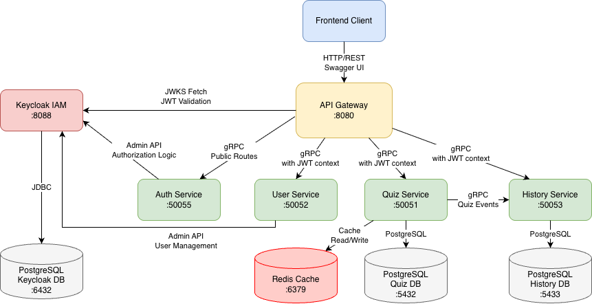

## как считаются результаты
у каждого квиза есть `x` возможных результатов. на вопрос имеется какой-то `y` ответов, и к каждому ответу принадлежит ровно `x` весов. веса выбранного ответа прибавляются к тоталу для каждого результата. финальным является результат, в который выбранные ответы добавили больше всего веса.

## архитектура бэкенда

## как запустить
```shell
# поднять окружение
docker compose up -d

# запустить скрипт и получить секретный ключ
bash scripts/setup-keycloak.sh

# обновить значение `KEYCLOAK_ADMIN_CLIENT_SECRET` и пересоздать нужные сервисы
docker compose up -d --force-recreate auth-service user-service
```
## `.env` для локального запуска
```dotenv
KEYCLOAK_BASE_URL=http://localhost:8088
KEYCLOAK_REALM=myrealm
KEYCLOAK_PUBLIC_CLIENT_ID=whoami-public
KEYCLOAK_PUBLIC_CLIENT_SECRET=
KEYCLOAK_ADMIN_CLIENT_ID=whoami-admin
KEYCLOAK_ADMIN_CLIENT_SECRET=<CHANGE_ME>
```
