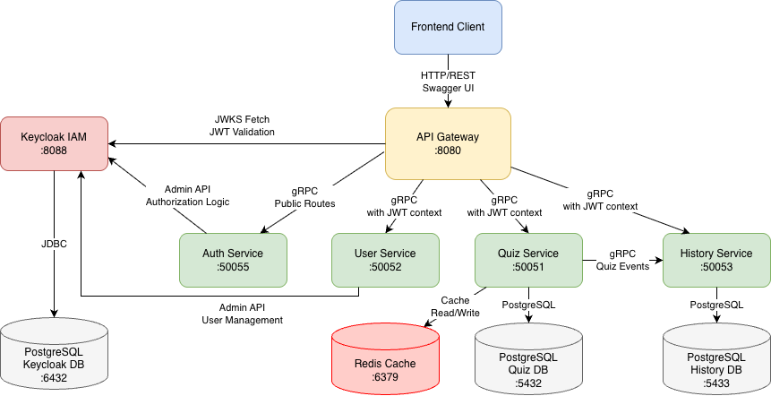

## архитектура бэкенда


## локальный запуск (Docker)

```shell
cd deployments/docker

# поднять core сервисы (gateway, auth, quiz, user, history, postgres, redis)
docker compose up -d

# поднять с keycloak
docker compose --profile keycloak up -d

# поднять с мониторингом (prometheus, grafana)
docker compose --profile monitoring up -d

# поднять всё
docker compose --profile keycloak --profile monitoring up -d
```

Переменные окружения: `deployments/docker/.env`

### настройка keycloak

```shell
# запустить скрипт и получить секретный ключ
bash scripts/setup-keycloak.sh

# обновить KEYCLOAK_ADMIN_CLIENT_SECRET в .env и пересоздать сервисы
docker compose --profile keycloak up -d --force-recreate auth-service user-service
```

## локальный запуск (без Docker)

Для запуска сервисов через `go run` используется `.env` в корне проекта.

```shell
# скопировать пример
cp deployments/docker/.env .env

# изменить пути на localhost
# KEYCLOAK_BASE_URL=http://localhost:8088

# запустить сервис
cd services/gateway && go run ./cmd/gateway
```

Переменные окружения: `/.env`

## Makefile

```shell
make up            # docker compose up
make up-keycloak   # + keycloak
make up-monitoring # + prometheus/grafana
make up-all        # всё
make down          # остановить
make down-v        # остановить + удалить volumes
make logs          # логи
make lint          # golangci-lint
make test          # тесты
make tidy          # go mod tidy
```

## CI/CD

- **CI**: `.github/workflows/ci.yml` — lint, test для изменённых сервисов
- **CD**: `.github/workflows/cd.yml` — build, push в ghcr.io, deploy через SSH

Документация: `.github/README.md`

## возможные улучшения
- kafka
- исправить метрики
- накрутить nginx
- поднять несколько инстансов сервиса (load balancer — см. `LOAD_BALANCER.md`)
- переделать главный сервис
- придумать темплейт для сервиса
- отдавать фронт с бэка
- добавить данные в миграции
- переделать конфигурацию реалма keycloak
  - https://www.google.com/search?q=how+to+setup+keycloak+realm+on+startup+in+docker&sca_esv=50bdd2a08bdd7bce&ei=dedFaa5jr83A8A-ggfLgBQ&ved=0ahUKEwju8YS47sqRAxWvJhAIHaCAHFwQ4dUDCBA&uact=5&oq=how+to+setup+keycloak+realm+on+startup+in+docker&gs_lp=Egxnd3Mtd2l6LXNlcnAiMGhvdyB0byBzZXR1cCBrZXljbG9hayByZWFsbSBvbiBzdGFydHVwIGluIGRvY2tlcjIFEAAY7wUyCBAAGIAEGKIEMgUQABjvBTIIEAAYgAQYogQyCBAAGIAEGKIESLQjUO0HWKAgcAF4AZABAJgBogKgAfcTqgEGMC4xNi4xuAEDyAEA-AEBmAIKoAKpC8ICChAAGLADGNYEGEfCAgQQABgewgILEAAYgAQYhgMYigXCAggQIRigARjDBJgDAIgGAZAGCJIHBTEuNy4yoAevOrIHBTAuNy4yuAeiC8IHBTAuNi40yAcigAgA&sclient=gws-wiz-serp
